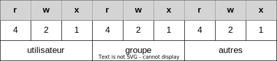

---
theme: afpa
_class: lead
paginate: true
backgroundColor: #fff
backgroundImage: 'linux2.webp'
marp: true
----------------------------------------------------------------
<!-- _color: white -->


# 60 minutes pour découvrir `Linux`

----------------------------------------------------------------
# Histoire d'Unix
Dans les années 1970, le laboratoire **Bell Lab** de l'entreprise **AT&T** crée le système d'exploitation multi-utilisateurs Unix.

Ce système sera repris par beaucoup d'entreprises et donnera naissance à une multitude de variantes d'`Unix`.

Les survivants actuels:
- **BSD** (**FreeBSD**, **NetBSD**, **OpenBSD**)
- **iOS**, **macOSX**
- **AIX**, **Solaris**, **HP-UX**

----------------------------------------------------------------
# Linux

Linux est un système inspiré du système Unix.

Il existe une multitude (>500) de distributions RedHat, Suze, Ubuntu... (Debian et Fedora ont servi de base) 

Freebox, BouyguesBox..., Andoid utilisent aussi un noyau `Linux`


----------------------------------------------------------------
# Organisation du système de fichiers

`/etc`          fichiers de configuration du système

`/root`         répertoire home du super utilisateur
`/sbin`         outils réservés à l'administrateur

`/home`         répertoire pour les profils utilisateurs

`/var`          
`/usr`          programmes du système pour les utilisateurs
`/lib`
`...`


----------------------------------------------------------------
# sudo

`sudo` permet d'obtenir les droits `su` ou `root` pour exécuter une commande.

Exemple:
```
sudo kill xxx
```

*Le système vous demande de saisir **votre** mot de passe !*

*L'utilisateur qui lance cette commande doit être habilité (autorisé à utiliser `sudo`) !*


----------------------------------------------------------------
# APT (Gestion des packages)

- Mettre à jour la liste de paquets
`sudo apt update`
- Mettre à jour le système
`sudo apt upgrade`
- Installer une application
`sudo apt install mc`
- Supprimer une application
`sudo apt remove mc --purge`


----------------------------------------------------------------
# la console

Ouvrir un terminal `Ctrl-Alt-T` 

Copier/Coller avec `Ctrl-Maj-C` / `Ctrl-Maj-V`

Basculer en mode texte `Ctrl-F3` **...** `Ctrl-F6`

Pour manipuler les fichiers dans la console
- Afficher `ls`
- changer de répertoire `cd`
- Créer ou supprimer de répertoires `mkdir`, `rm` 

----------------------------------------------------------------
# Quelques commandes...

|  | Commandes |
|--|--|
|Afficher la liste des processus|`ps ax`|
|Tuer le processus xxx|`kill -9 xxx`|
|Liste des périphériques USB|`lsusb`|
|Liste des périphériques `block` (disques durs) |`lsblk`|
|Utilitaire de gestion des partitions |`fdisk /dev/sda`|
|Afficher les adresses `IP` des interfaces réseaux|`ip a`|
|Liste des connexions réseaux en cours|`ss`|
|Outil de découverte du réseau|`nmap`|


----------------------------------------------------------------
# Gestion des droits




`r` lecture 
`w` écriture 
`x` exécution pour un fichier, positionner pour un répertoire  

**Exemple:**
`rwx rwx rx` =  lecture, écriture, positionnement pour le propriétaire, le groupe, pas le droit d'écrire pour les autres utilisateurs. 

 
----------------------------------------------------------------
# Gestion des droits


#### Combinaison binaire (exemple)

- lecture seule `r` = 4 
- lecture + éxecution `r` + `x` = 4 + 1 = 5
- lecture, écriture = `r` + `w` = 4 + 2 = 6

 `rwx rwx rx` = `7 7 5`


----------------------------------------------------------------
# Gestion des droits

La commande `chmod` permet de manipuler les droits sur les fichiers ou répertoires.

droits `rwx` `rwx` `r_x` pour le dossier utilitaires
```bash
chmod 775 utilitaires
```


droits `rwx` `___` `___` pour le dossier perso
```bash
chmod 700 perso
```


droits `rwx` `rwx` `rwx` pour le dossier commun
```bash
chmod 777 commun
```

----------------------------------------------------------------
# Gestion des droits

Si vous utilisez le système de fichier `ext4`, vous pouvez utilisez le package `acl` qui fournit des fonctionnalités avancées de gestion des droits.

**Exemple:**
`setfacl -dR -m u:www-data:rwX -m u:dev01:rwX projet`


----------------------------------------------------------------
# Gestion des utilisateurs

`adduser`

`passwd`

`usermod`

----------------------------------------------------------------
# Gestion des services (systemd)

`systemd` est le gestionnaire de services.

`systemctl` est l'outil de gestion de `systemd`

----------------------------------------------------------------
# Gestion des services (systemd)


| Commandes | |
|--|-|
|`systemctl start apache2`| Démarrer le service **apache2**|
|`systemctl stop apache2`| Arréter le service **apache2**|
|`systemctl restart apache2`| Re démarrer le service|
|||
|`systemctl enable apache2`| Rendre actif au démarrage|
|`systemctl disable apache2`||

`systemctl` permet d'afficher l'ensemble des services.

----------------------------------------------------------------
# Ressources


### 1. Documentation locale
    man


### 2. Guide d'aministration en ligne
[https://debian-handbook.info/browse/fr-FR/stable/index.html](https://debian-handbook.info/browse/fr-FR/stable/index.html)
