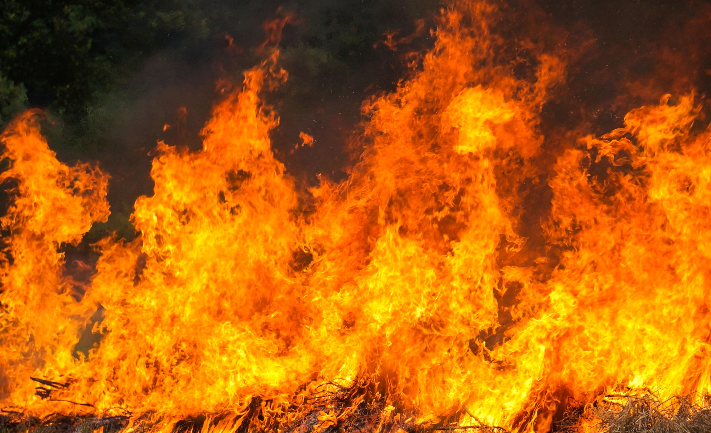

---
theme: afpa
_class: lead
paginate: true
backgroundColor: #fff
backgroundImage: 'linux2.webp'
marp: true
----------------------------------------------------------------


# `UFW`
`(mise en place du Firewall)`

----------------------------------------------------------------
# Présentation


----------------------------------------------------------------
# Activer / Désactiver UFW


 Vérifier le statut actuel
```
sudo ufw status
```

Activer UFW : (c'est à dire appliquer les règles définies)
```
sudo ufw enable
```

Désactiver UFW : (c'est à dire ne plus appliquer les règles définies)
```
sudo ufw disable
```
